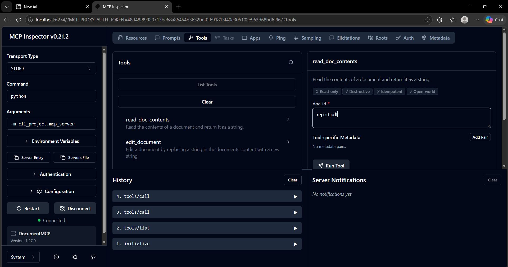
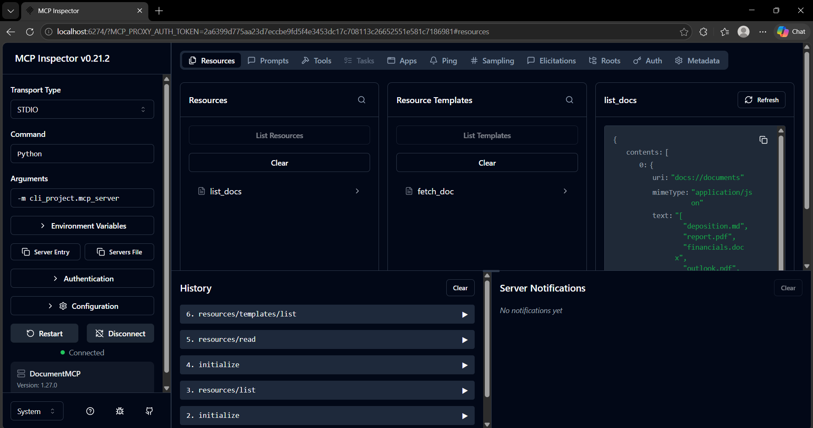
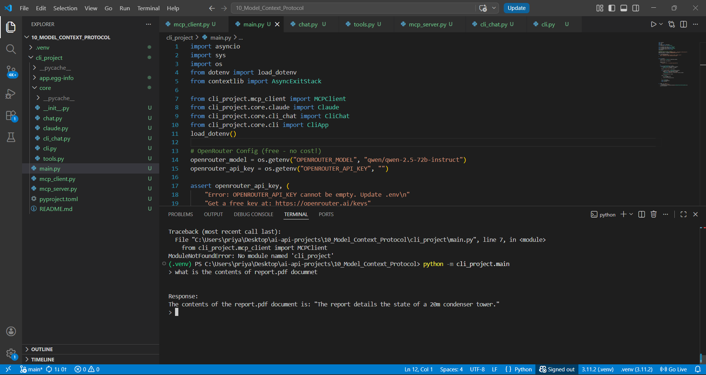

# MCP Document System

A Python-based document management system built on the **Model Context Protocol (MCP)**. Interact with documents through structured tools, resources, and prompts — with LLM-powered query support via OpenRouter.

---

## Features

- Document resource system (`list_docs`, `fetch_doc`)
- Tool-based document operations — read and edit document contents
- LLM integration via OpenRouter for natural language queries
- Fully functional MCP server with Inspector support
- CLI-based interactive client

---

## Architecture

```
CLI (main.py)
    ↓
MCP Client (mcp_client.py)
    ↓
MCP Server (mcp_server.py)
    ↓
Tools + Resources (tools.py, core/)
    ↓
Documents
```

---

## Screenshots

### MCP Inspector — Tools


### MCP Inspector — Resources


### MCP Inspector — Prompts


### CLI Interaction


---

## Setup

### 1. Clone the repository

```bash
git clone https://github.com/<your-username>/mcp-document-system.git
cd mcp-document-system
```

### 2. Create a virtual environment

```bash
python -m venv .venv
.venv\Scripts\activate       # Windows
# source .venv/bin/activate  # macOS/Linux
```

### 3. Install dependencies

```bash
pip install mcp anthropic python-dotenv
```

### 4. Configure environment variables

Create a `.env` file in the project root:

```env
OPENROUTER_API_KEY=your_api_key_here
OPENROUTER_MODEL=qwen/qwen-2.5-72b-instruct
```

---

## Usage

### Run the MCP Server (for Inspector)

```bash
mcp dev cli_project/mcp_server.py
```

Then open the Inspector at: `http://localhost:6274`

### Run the CLI Client

```bash
python -m cli_project.main
```

**Example query:**

```
> what is the contents of report.pdf document

The report details the state of a 20m condenser tower.
```

---

## Available Tools

| Tool | Input | Output |
|------|-------|--------|
| `read_doc_contents` | `doc_id` | Document text |
| `edit_document` | `doc_id`, `old_str`, `new_str` | Updated document |

---

## Project Structure

```
cli_project/
├── core/
│   ├── chat.py
│   ├── cli.py
│   ├── cli_chat.py
│   ├── tools.py
│   └── claude.py
├── mcp_client.py
├── mcp_server.py
├── main.py
├── pyproject.toml
└── README.md
screenshots/
├── tools.png
├── resources.png
├── prompts.png
└── cli.png
```

---

## MCP Inspector Capabilities

| Action | Description |
|--------|-------------|
| `resources/list` | List all available documents |
| `resources/read` | Read a specific document |
| `tools/call` | Execute a tool (read or edit) |
| `prompts/list` | Inspect registered prompts |

---

## Roadmap

- [ ] Database storage backend
- [ ] Improved PDF/DOCX parsing
- [ ] Authentication layer
- [ ] Web UI

---

## Author

**Priya Singh** — B.Tech CSE | AI/ML Enthusiast

---

*If this project helped you, consider giving it a ⭐ on GitHub!*
